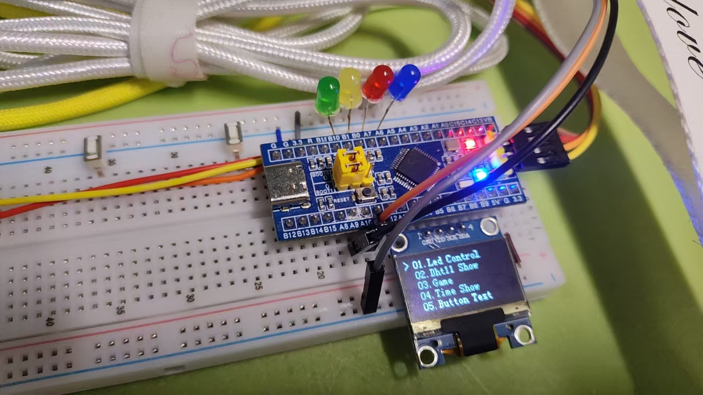

# 基于STM32+FreeRTOS的轻量级UI界面操作系统
✨ 按键交互 | OLED多级菜单 | FreeRTOS多任务 | LED控制 | 温湿度实时采集

## 项目简介
本项目基于 STM32F103 单片机 + FreeRTOS 实时操作系统开发，
通过按键实现 OLED 多级菜单切换，完成 LED 状态控制、DHT11 温湿度数据采集与实时显示。
采用 FreeRTOS 多任务调度管理（UI显示任务、按键扫描任务、数据采集任务、LED控制任务），
系统稳定性强、响应速度快，是嵌入式 RTOS 实战与求职展示的优质项目。

## 硬件环境
- 主控芯片：STM32F103C8T6
- 显示模块：0.96寸 I2C OLED 显示屏（128×64）
- 交互模块：独立按键（菜单切换/功能控制）
- 输出模块：LED 指示灯
- 采集模块：DHT11 温湿度传感器
- 开发环境：Keil5 MDK + STM32CubeMX（HAL库）

## 软件架构（FreeRTOS 核心）
项目基于 FreeRTOS 多任务架构设计，任务独立解耦，系统流畅稳定：
1. **UI显示任务**：OLED菜单渲染、页面刷新、数据展示
2. **按键扫描任务**：按键检测、消抖、指令下发
3. **温湿度采集任务**：DHT11数据读取、滤波、上传
4. **LED控制任务**：接收指令，执行LED开关/闪烁
5. **任务通信**：FreeRTOS 队列/信号量实现任务间数据交互

## 核心功能
✅ FreeRTOS 多任务调度，系统实时响应
✅ OLED 多级 UI 菜单界面，按键流畅切换
✅ 独立按键控制菜单切换与功能执行
✅ LED 多种工作状态控制（开关/闪烁）
✅ DHT11 温湿度实时采集 + OLED 显示
✅ 模块化代码，易移植、易扩展

## 项目实物图

## 快速运行
1. 硬件接线：OLED(I2C)、按键、LED、DHT11 按引脚定义连接
2. Keil5 打开工程，编译无报错
3. ST-Link 下载程序至 STM32
4. 上电自动运行，通过按键测试所有功能

## 工程目录
Core/          内核与启动文件
Drivers/       HAL库与外设驱动
FreeRTOS/      FreeRTOS 操作系统源码
User/          应用任务、UI逻辑、业务代码
README.md      项目说明文档

## 技术亮点
1. 实战 FreeRTOS 多任务开发，掌握 RTOS 核心原理
2. 裸机+操作系统双结合，嵌入式开发能力全面
3. 完整人机交互系统，输入-处理-输出全流程实现
4. 代码规范、工程结构清晰，求职面试极具竞争力

## 作者
GitHub：xiaotao5294
项目：https://github.com/xiaotao5294/master-tao
